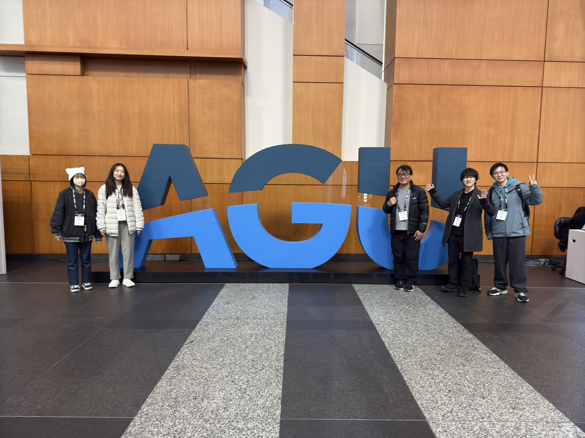

I'm a second-year Ph.D. student from [ICHII Lab](https://ichiilab.weebly.com/) at [Chiba University](https://www.chiba-u.ac.jp/e/) in Japan.  
My supervisor is [Prof. Kazuhito Ichii](https://researchmap.jp/kichii?lang=en) from [Center for Environmental Remote Sensing (CEReS)](https://ceres.chiba-u.jp/en/top-eng/) at Chiba University.
My research interests include terrestrial monitoring, geostationary satellite land product development, BRDF modeling, and Deep learning.

AGU24
======
Our group attended AGU24 in Washington, DC.

My poster

Himawari-8/9 AHI Land Surface Reflectance Dataset was published
======
Himawari-8/9 AHI Land Surface Reflectance(LSR) Dataset has been published at CEReS's FTP server.
Please See the dataset page for details.

